<div align="center">


# Your car. On watch.

**Dashcam and parked surveillance for BYD head units.**
Records locally on the car's own cameras, watches while you're parked, and opens
the same dashboard from your phone.

[](https://github.com/UnrealSalty/Strike/releases/latest)
[](https://github.com/UnrealSalty/Strike/releases)
[](https://discord.gg/DTBZRgHX3s)

[**Download the APK**](https://github.com/UnrealSalty/Strike/releases/latest) &nbsp;·&nbsp; [strikebyd.com](https://strikebyd.com) &nbsp;·&nbsp; [Get started](#get-started) &nbsp;·&nbsp; [Report a bug](https://github.com/UnrealSalty/Strike/issues)

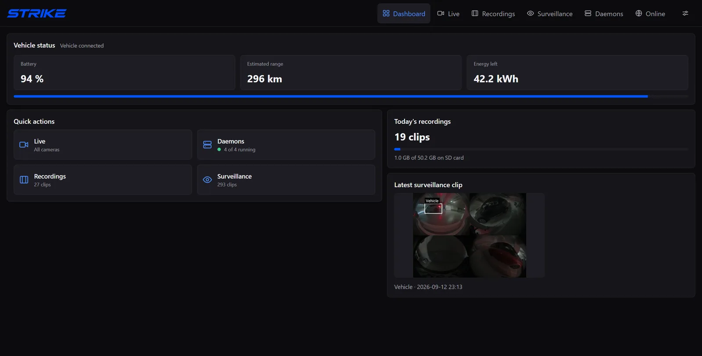

<sub>Records while you drive &nbsp;·&nbsp; Watches while you're parked &nbsp;·&nbsp; Opens in any browser</sub>

<sub>Interface previews use sample vehicle, storage, and connection values.</sub>

</div>

## Features

- 🎥 **Dashcam.** Record whenever the car is on, or only while driving. Choose clip
length, quality, frame rate, and optional cabin audio.
- 👁️ **Parked surveillance.** Save activity around the car in Smart mode, or keep
recording while parked in Continuous mode. Arm on ignition off or locking, with
an optional red screen deterrent.
- ▶️ **Live and playback.** View all four cameras together or pick an individual
angle. Browse recordings and surveillance events in separate libraries.
- 💾 **Your storage.** Save to internal storage, SD, or USB. Give recordings and
surveillance their own space limits; the oldest finished clips rotate out.
- 📱 **Access from your phone.** Open the dashboard on your local network, or use
your own domain with an optional Cloudflare tunnel.

Footage is stored on the car, and detection runs on the head unit. Remote access
is optional. Strike has no account or subscription of its own.

## Your car, at a glance

<table>
<tr>
<td width="50%">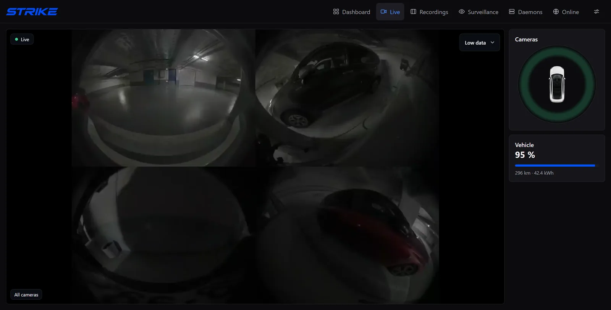<br><sub><b>Live</b> — all four cameras together, with the radar camera picker.</sub></td>
<td width="50%">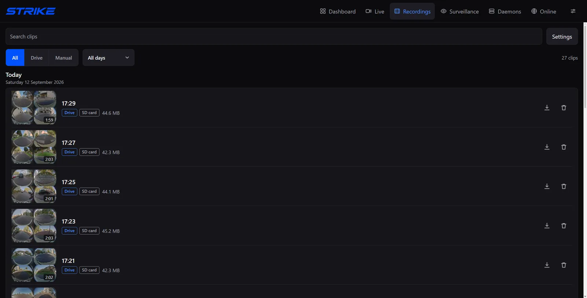<br><sub><b>Recordings</b> — the drive-clip library, newest first.</sub></td>
</tr>
<tr>
<td width="50%">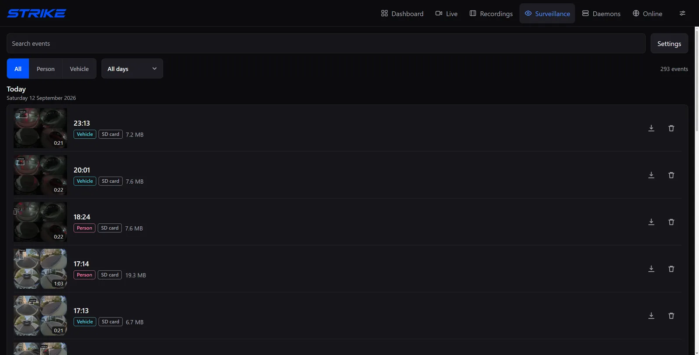<br><sub><b>Surveillance</b> — parked events, with person and vehicle detections.</sub></td>
<td width="50%">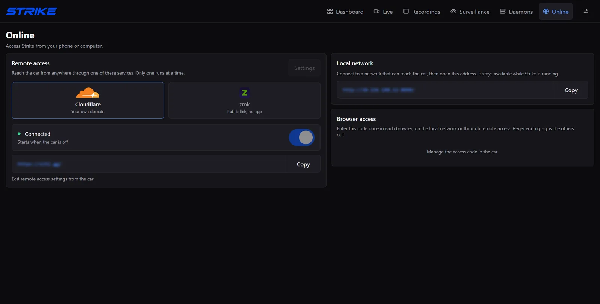<br><sub><b>Online</b> — remote access with Cloudflare and zrok.</sub></td>
</tr>
<tr>
<td width="50%">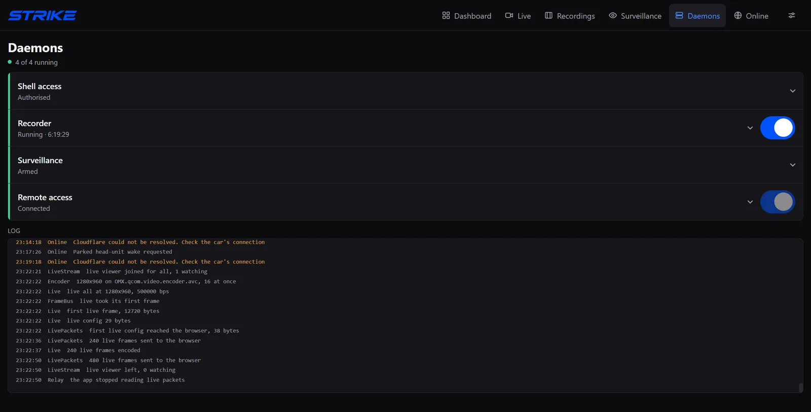<br><sub><b>Daemons</b> — recorder, surveillance, remote access, and the log.</sub></td>
<td width="50%">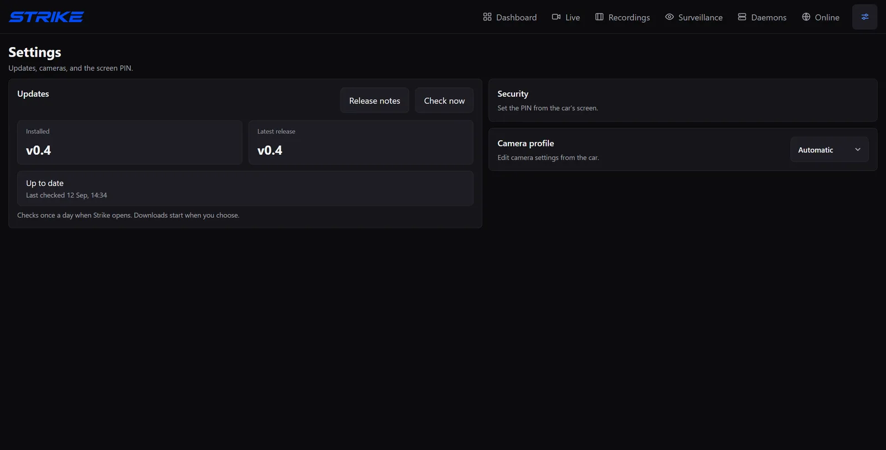<br><sub><b>Settings</b> — versions, camera profile, and the in-car PIN.</sub></td>
</tr>
</table>

## Four cameras. One recording.

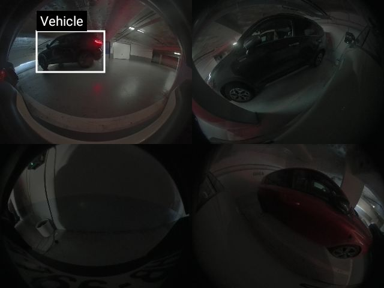

All four cameras go into a single clip. Detections sit on the timeline, so you
can jump to the moment instead of hunting for it, then fill the screen with one
camera.

Recording, surveillance, and live view share one camera feed. Strike uses
hardware video encoding on supported head units and only runs the live encoder
while someone is watching. Motion checks limit how often Smart surveillance runs
person and vehicle detection.

<br clear="all">

## Parked, not blind

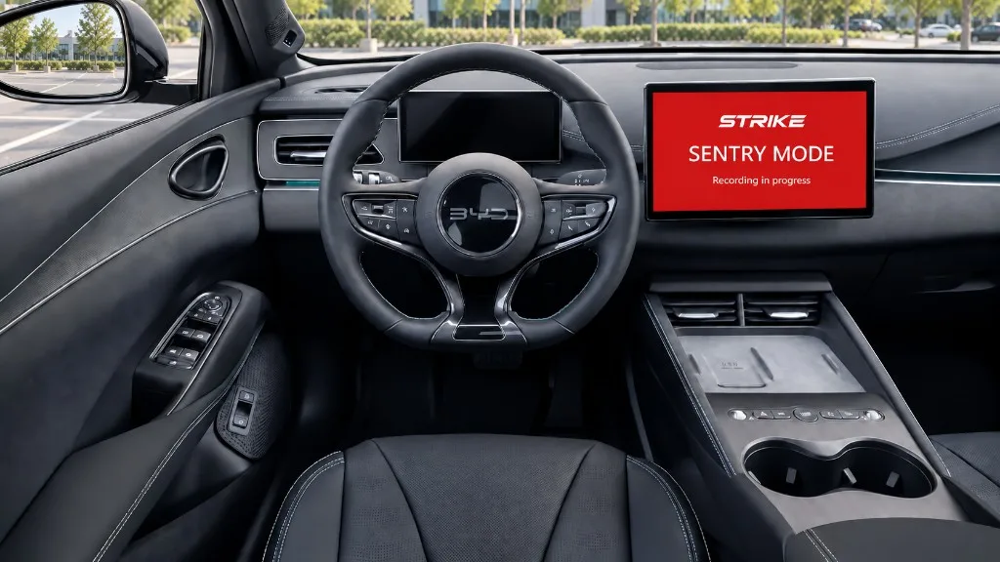

Strike arms itself when you leave, watches for people and vehicles close by, and
saves what happened.

- **Arms on** — ignition off, or locking the car.
- **Keeps recording** — 20 seconds past the last detection.
- **Clip length cap** — about 2 minutes per event.
- **Optional deterrent** — fills the screen with red and a message you set.

On an Atto 2 with surveillance armed, this used about **1–2 % of the battery over
one day parked**. Other cars and settings will differ; it keeps the head unit and
cameras awake, so a fixed number of days is not promised.

<br clear="all">

## Built lean

- 📦 **One APK, about 14 MB.** No companion app, no Play services, no installer.
- 🧩 **Four dependencies.** core-ktx, coroutines, `dadb` for the local ADB
connection, and TensorFlow Lite for detection.
- ⚡ **An interface of about 230 KB.** Plain HTML, CSS, and JavaScript. No
framework, no bundler, no build step, no CDN, and no remote fonts, so every
screen loads with the car offline.
- 🔒 **No telemetry, analytics, or crash reporting.** The only address Strike calls
on its own is GitHub's release API, at most once a day.

## Away from the car. Still in the picture.

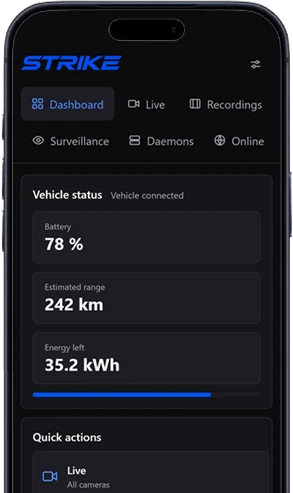

Strike serves its own interface. Open the car's address and you get the same live
view and recordings, behind an access code. Connect on your local network, or
reach the car from anywhere with your own domain over a Cloudflare tunnel, or a
public zrok link. Only one remote service runs at a time.

The head unit has to be awake and online. A tunnel cannot wake a sleeping car.

<br clear="all">

## Get started

1. Download **Strike.apk** from the [latest release](https://github.com/UnrealSalty/Strike/releases/latest)
  and install it on the head unit.
2. Open Strike and grant storage and microphone permissions. Audio is recorded
  only when you enable cabin audio.
3. Enable the head unit's ADB access, then select **Daemons → Connect** if needed
  and accept the debugging prompt. Strike restarts once after initial access and
   permissions are ready.
4. Open **Recordings → Settings**. Choose a recording mode, storage location,
  space limit, and clip length. Recording starts out switched off.
5. Turn on **Recorder** in **Daemons**.
6. For parked recording, open **Surveillance → Settings**, enable **Watch the car
  when it is off**, and choose Smart or Continuous mode.

<table>
<tr>
<td width="50%">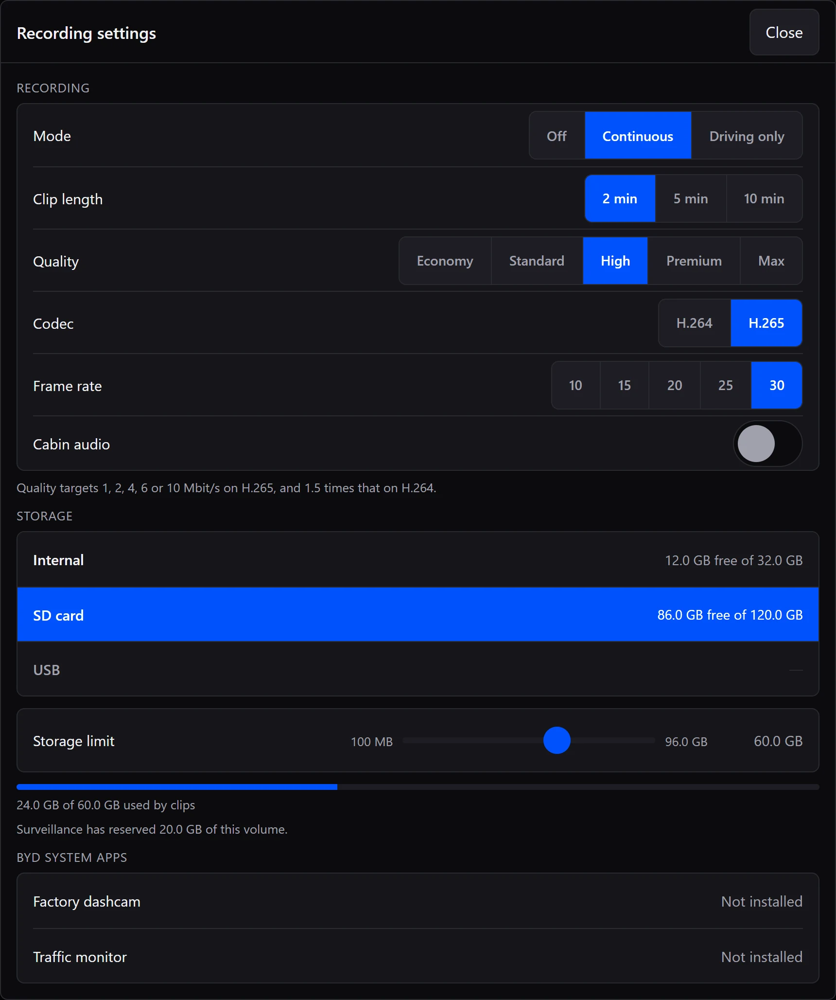<br><sub><b>Recording settings</b></sub></td>
<td width="50%">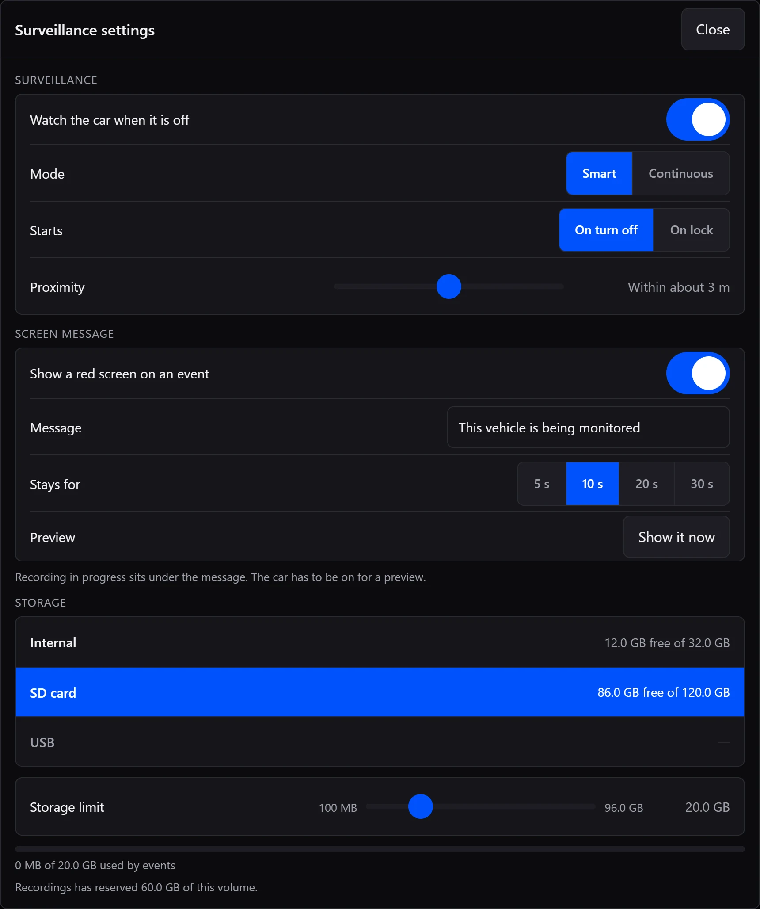<br><sub><b>Surveillance settings</b></sub></td>
</tr>
</table>

## Compatibility

Strike needs a BYD head unit running Android 9 or newer on 64-bit ARM, with
compatible camera and ignition interfaces and local ADB access. There is no
model-name restriction; support depends on the head unit and firmware.

Testing so far has been on a BYD Atto 2. Other models and firmware versions have
not yet been verified.

If the camera views are split incorrectly, **Settings → Cameras** offers legacy
profiles for Seal, Atto 3, and Tang 2022 using Overdrive's camera mappings, plus
Strike's Atto 2 profile. After choosing one, turn **Recorder** off and on in
**Daemons**. Automatic uses camera-tag discovery, then recognizable Atto 2 or
Atto 3 model names, otherwise Overdrive's legacy camera-1 profile. If that camera
opens but sends no frames for 25 seconds, Automatic tries raw camera 0 and remembers
it after frames arrive. A firmware change clears that preference. These profiles
still need testing on each head unit.

Selecting **Atto 2** keeps camera 0 without waiting for automatic recovery, even
when the head unit identifies itself only as "BYD AUTO".

Hardware details

The current camera path uses BYD's `AVMCamera` interface with a horizontal strip
of four views. Different layouts need additional handling. The AIS/QCarCam path
used by some DiLink 5 units is not implemented. A phone or emulator can show the
interface but cannot provide the car's cameras.

Automatic parked operation requires working ignition readings. Local ADB must be
available on port 5555 and authorized on the head unit.

## Access from your phone

On the car's **Online** page, copy a local address and open it on a phone or
computer that can reach the car's network. Enter the **Browser access** code
shown in the car. The browser remembers the session for 90 days.

This code protects both local and remote access. Regenerating it signs out all
browsers. The optional in-car PIN in **Settings → Security** is separate. Local addresses use HTTP, so use a
trusted network.

In the browser's Live view, choose **Low data**, **Balanced**, or **High** stream
quality. This leaves recorded clips unchanged. If several browsers are watching,
the lowest selected quality applies to the shared live stream.

Set up Cloudflare with your own domain

1. Add your domain to Cloudflare and create a dedicated Cloudflare Tunnel.
2. Copy the tunnel token from the connector installation command.
3. Add a published application route for a hostname such as `car.example.com`,
  with **HTTP** service `127.0.0.1:8090`.
4. In **Online → Cloudflare tunnel → Settings**, enter the hostname and token,
  choose when it should run, and select **Save**.
5. Turn on the tunnel and open `https://car.example.com/`. Enter Strike's browser
  access code. You can also put Cloudflare Access in front of it.

Use a separate tunnel for emulator testing. If two devices run the same tunnel
token, Cloudflare can send requests to either device.

The tunnel can run **Always**, when the **Car is off**, or **On lock**. On lock
requires a confirmed lock reading. Automatic modes stop if ignition readings are
unavailable. The same tunnel switch appears in **Daemons**; turning it off cancels
automatic starts too. Tunnel controls and setup are available from the car;
browsers show their status.

The head unit must stay awake and have internet access. The tunnel cannot wake
the car. Playback depends on upload speed and browser codec support. Review
[Cloudflare's video delivery policy](https://developers.cloudflare.com/fundamentals/reference/policies-compliances/delivering-videos-with-cloudflare/)
before using Live or recordings through a public tunnel hostname.

## Recording while parked

**Smart** saves activity when a person or vehicle comes close. Each confirmed
event keeps recording for another 20 seconds. Continued activity stays recorded,
splitting into clips of about two minutes. The red screen can hide while the clip
is still recording. Between events, motion detection stays on while the recording
encoder is idle.

**Continuous** records throughout the armed period using the configured clip
length. Parked clips do not include cabin audio. If lock state is unavailable,
surveillance's On lock mode falls back after 60 seconds of confirmed parking.

Parked capture uses power to keep the cameras and head unit awake. Battery use
has not been measured across vehicles. A sudden power cut can leave the clip
being written unplayable.

## Updates

Open **Settings → Updates** to check, download, and install a release. Strike
checks GitHub when opened or resumed, at most once a day. You choose when to
download and install.

The updater finishes the current clip before installation and restores recording
afterward if it was running. If the clip cannot finish, installation is cancelled.
Settings, the in-car PIN, browser access code, remembered browser sessions, and
saved footage are kept. Uninstalling Strike or clearing its app data resets the
PIN and browser access. In-app installation needs authorized ADB
access and an APK signed with the same key as the installed version.

## PIN recovery

Forgot the in-car PIN?

Select **Forgot PIN?** below the lock-screen keypad for these instructions. From
a computer with an authorized ADB connection to the head unit, run:

```powershell
adb shell touch /data/local/tmp/.strike_pin_reset
```

Reopen or refresh Strike, then set a new PIN under **Settings → Security**.
This clears the PIN and failed-attempt lockout. Recordings and other settings
are kept.

## Build

Build setup, emulator instructions, release publishing, and contribution guidelines
are in [CONTRIBUTING.md](CONTRIBUTING.md#build).

## Credits

Strike builds on [Overdrive](https://github.com/yash-srivastava/Overdrive-release)'s
work on BYD camera access, vehicle integration, and parked operation. It also
reuses assets from that project, including the car graphic and bundled detection
model. Thanks to Yash Srivastava and the Overdrive contributors.

Overdrive is not required to install or build Strike. Third-party components keep
their upstream licenses; see [Overdrive's notices](https://github.com/yash-srivastava/Overdrive-release/blob/main/THIRD_PARTY_NOTICES.md)
and the bundled [Cloudflare connector notices](app/src/main/assets/cloudflared-notices.txt).
