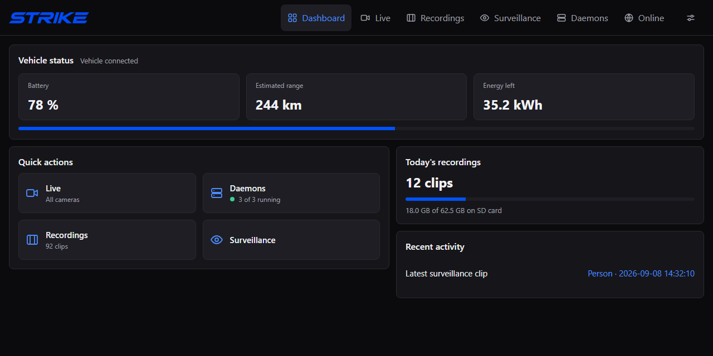
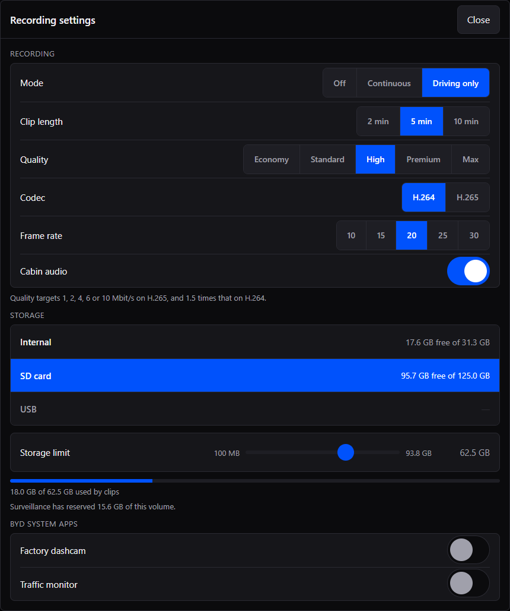
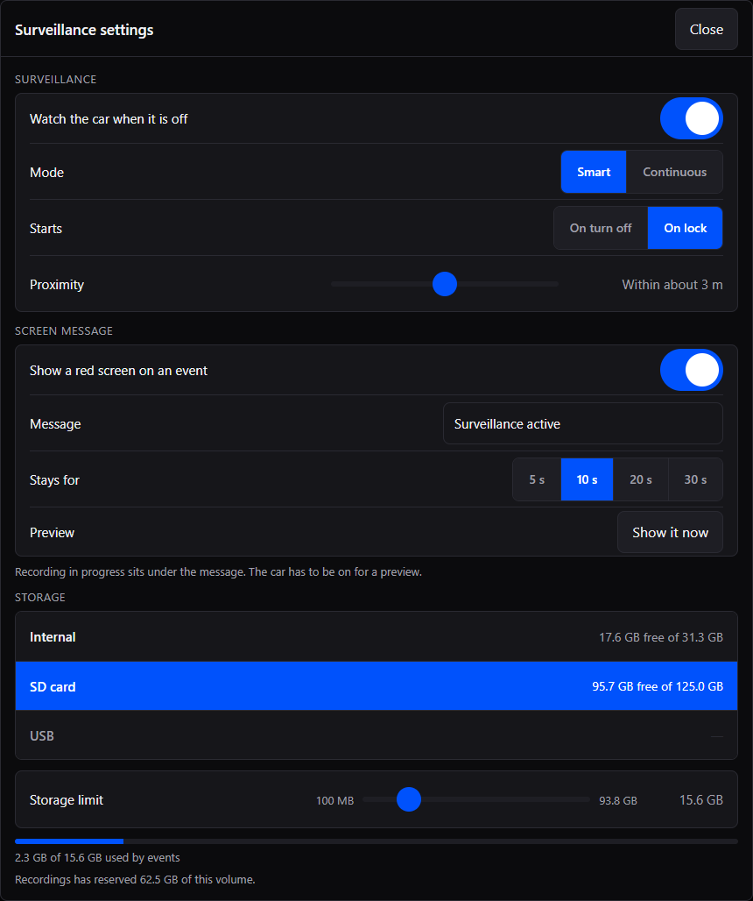
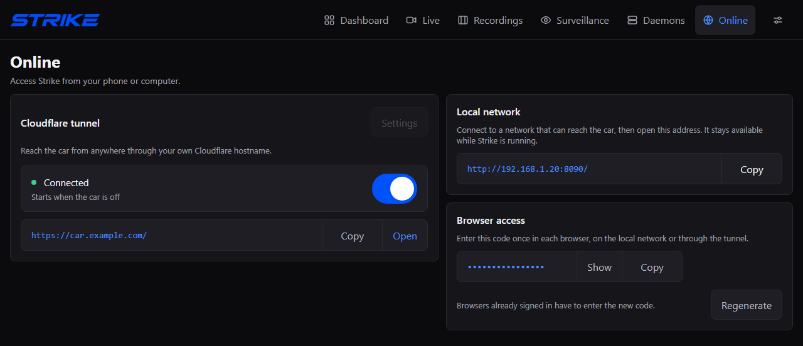
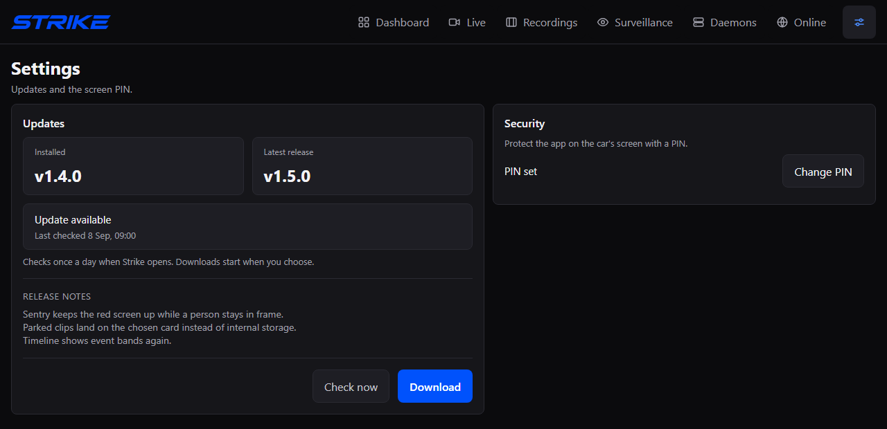

<p>
  
</p>

Lightweight dashcam, parked surveillance, and live cameras for BYD head units.
Built around recording, with a small web interface for the car's screen and your
phone.

**[Download the APK](https://github.com/UnrealSalty/Strike/releases/latest)** · [Get started](#get-started) · [Report a bug](https://github.com/UnrealSalty/Strike/issues)



*Interface previews use sample vehicle, storage, and connection values.*

## Features

- **Dashcam.** Record whenever the car is on, or only while driving. Choose clip
  length, quality, frame rate, and optional cabin audio.
- **Parked surveillance.** Save activity around the car in Smart mode, or keep
  recording while parked in Continuous mode. Arm on ignition off or locking, with
  an optional red screen deterrent.
- **Live and playback.** View all four cameras together or pick an individual
  angle. Browse recordings and surveillance events in separate libraries.
- **Your storage.** Save to internal storage, SD, or USB. Give recordings and
  surveillance their own space limits; the oldest finished clips rotate out.
- **Access from your phone.** Open the dashboard on your local network, or use
  your own domain with an optional Cloudflare tunnel.

Footage is stored on the car, and detection runs on the head unit. Remote access
is optional. Strike has no account or subscription of its own.

Recording, surveillance, and live view share one camera feed. Strike uses hardware
video encoding on supported head units and only runs the live encoder while
someone is watching. Motion checks limit how often Smart surveillance runs person
and vehicle detection.

<table>
  <tr>
    <th>Recording</th>
    <th>Surveillance</th>
  </tr>
  <tr>
    <td width="50%"><a href="art/screenshots/recording-settings.png"></a></td>
    <td width="50%"><a href="art/screenshots/surveillance-settings.png"></a></td>
  </tr>
</table>

## Get started

1. Download **Strike.apk** from the [latest release](https://github.com/UnrealSalty/Strike/releases/latest)
   and install it on the head unit.
2. Open Strike and grant storage and microphone permissions. Audio is recorded
   only when you enable cabin audio.
3. Enable the head unit's ADB access, then select **Daemons → Connect** if needed
   and accept the debugging prompt. Strike restarts once after initial access and
   permissions are ready.
4. Open **Recordings → Settings**. Choose a recording mode, storage location,
   space limit, and clip length. Recording starts out switched off.
5. Turn on **Recorder** in **Daemons**.
6. For parked recording, open **Surveillance → Settings**, enable **Watch the car
   when it is off**, and choose Smart or Continuous mode.

## Compatibility

Strike needs a BYD head unit running Android 9 or newer on 64-bit ARM, with
compatible camera and ignition interfaces and local ADB access. There is no
model-name restriction; support depends on the head unit and firmware.

Testing so far has been on a BYD Atto 2. Other models and firmware versions have
not yet been verified.

<details>
<summary>Hardware details</summary>

The current camera path uses BYD's `AVMCamera` interface with a horizontal strip
of four views. Different layouts need additional handling. The AIS/QCarCam path
used by some DiLink 5 units is not implemented. A phone or emulator can show the
interface but cannot provide the car's cameras.

Automatic parked operation requires working ignition readings. Local ADB must be
available on port 5555 and authorized on the head unit.

</details>

## Access from your phone

On the car's **Online** page, copy a local address and open it on a phone or
computer that can reach the car's network. Enter the **Browser access** code
shown in the car. The browser remembers the session for 90 days.

This code protects both local and remote access. Regenerating it signs out all
browsers. The optional in-car PIN in **Settings → Security** is separate. Local addresses use HTTP, so use a
trusted network.



<details>
<summary>Set up Cloudflare with your own domain</summary>

1. Add your domain to Cloudflare and create a dedicated Cloudflare Tunnel.
2. Copy the tunnel token from the connector installation command.
3. Add a published application route for a hostname such as `car.example.com`,
   with **HTTP** service `127.0.0.1:8090`.
4. In **Online → Cloudflare tunnel → Settings**, enter the hostname and token,
   choose when it should run, and select **Save**.
5. Turn on the tunnel and open `https://car.example.com/`. Enter Strike's browser
   access code. You can also put Cloudflare Access in front of it.

The tunnel can run **Always**, when the **Car is off**, or **On lock**. On lock
requires a confirmed lock reading. Automatic modes stop if ignition readings are
unavailable. The same tunnel switch appears in **Daemons**; turning it off cancels
automatic starts too. Use the car or local address to turn it back on.

The head unit must stay awake and have internet access. The tunnel cannot wake
the car. Playback depends on upload speed and browser codec support. Review
[Cloudflare's video delivery policy](https://developers.cloudflare.com/fundamentals/reference/policies-compliances/delivering-videos-with-cloudflare/)
before using Live or recordings through a public tunnel hostname.

</details>

## Recording while parked

**Smart** saves activity when a person or vehicle comes close. Each confirmed
event keeps recording for another 20 seconds. Continued activity stays recorded,
splitting into clips of about two minutes. The red screen can hide while the clip
is still recording. Between events, motion detection stays on while the recording
encoder is idle.

**Continuous** records throughout the armed period using the configured clip
length. Parked clips do not include cabin audio. If lock state is unavailable,
surveillance's On lock mode falls back after 60 seconds of confirmed parking.

Parked capture uses power to keep the cameras and head unit awake. Battery use
has not been measured across vehicles. A sudden power cut can leave the clip
being written unplayable.

## Updates

Open **Settings → Updates** to check, download, and install a release. Strike
checks GitHub when opened or resumed, at most once a day. You choose when to
download and install.

The updater finishes the current clip before installation and restores recording
afterward if it was running. If the clip cannot finish, installation is cancelled.
Settings and saved footage are kept. In-app installation needs authorized ADB
access and an APK signed with the same key as the installed version.



## PIN recovery

<details>
<summary>Forgot the in-car PIN?</summary>

Select **Forgot PIN?** below the lock-screen keypad for these instructions. From
a computer with an authorized ADB connection to the head unit, run:

```powershell
adb shell touch /data/local/tmp/.strike_pin_reset
```

Reopen or refresh Strike, then set a new PIN under **Settings → Security**.
This clears the PIN and failed-attempt lockout. Recordings and other settings
are kept.

</details>

## Build

Build setup, emulator instructions, release publishing, and contribution guidelines
are in [CONTRIBUTING.md](CONTRIBUTING.md#build).

## Credits

Strike builds on [Overdrive](https://github.com/yash-srivastava/Overdrive-release)'s
work on BYD camera access, vehicle integration, and parked operation. It also
reuses assets from that project, including the car graphic and bundled detection
model. Thanks to Yash Srivastava and the Overdrive contributors.

Overdrive is not required to install or build Strike. Third-party components keep
their upstream licenses; see [Overdrive's notices](https://github.com/yash-srivastava/Overdrive-release/blob/main/THIRD_PARTY_NOTICES.md)
and the bundled [Cloudflare connector notices](app/src/main/assets/cloudflared-notices.txt).
